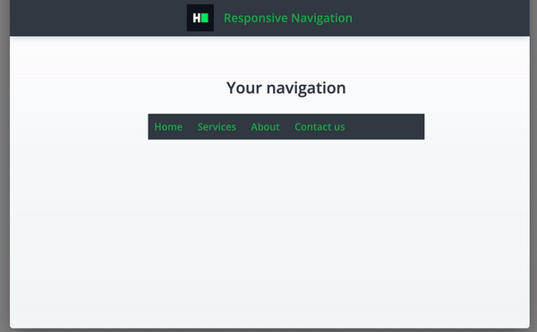

# CSS: Responsive navigation
Complete a partially completed application. Complete the application shown below in order to pass all the unit tests.

## Environment 

- Node Version: ^14
- Default Port: 8000

## Application Demo:


## Application description

Your navigation contains following elements:
* Navigation icon
* Navigation items with links

In mobile view when user clicks on hamburger icon either class `expanded` or `collapsed` is attached to div `.nav-items`

Complete a responsive navigation layout with the following UI:
* Navigation should take all the width of its container
* Navigation links as well as icon should have padding of 10px
* For the desktop layout (screen width ≥768px):
  * Hamburger icon should not be visible
  * All navigation items should be displayed (`.nav-items` container should have `max-height: 0`)
  * All navigation items should be positions horizontally
* For the mobile layout (screen width <768px):
  * Hamburger icon should be visible
  * When hamburger icon is hovered, it should not have underlining decoration
  * All navigation items should not be initially displayed
  * Navigation items should be shown when user clicks on a hamburger icon (functionality already provided)
  * All navigation items should be positions vertically
  * All navigation items should be centered

All the markup for the question has been added. As a candidate, you have to complete the CSS file to implement the above-stated features.

## Project Specifications

**Read Only Files**
- `test/*`
- `src/index.js`
- `src/index.html`
- `src/css/readonly.css`
- `app.js`

**Commands**
- run: 
```bash
npm start
```
- install: 
```bash
npm install
```
- test: 
```bash
npm test
```
